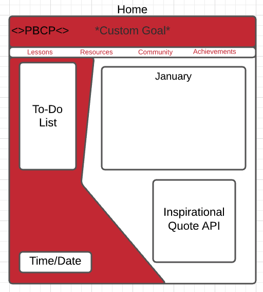
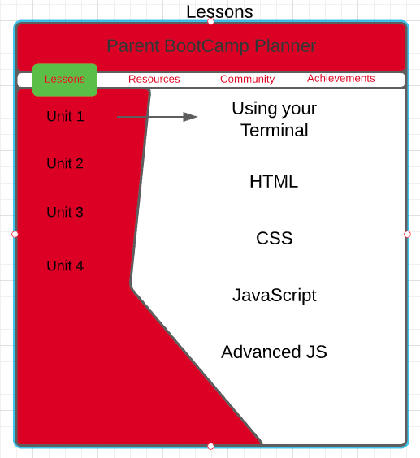
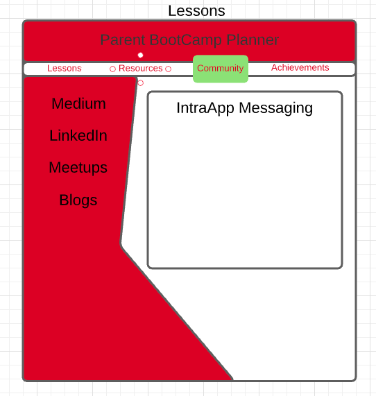
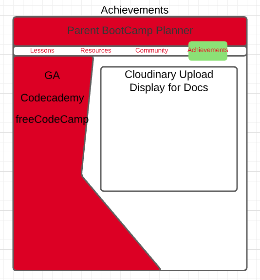
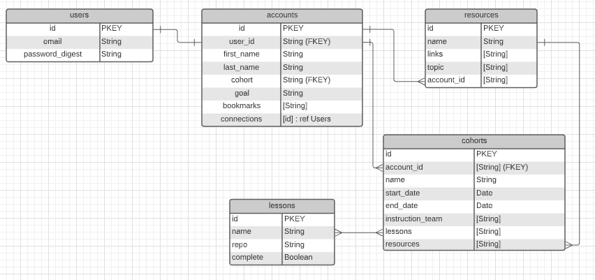

# ParentPlannerProject
### 01/04/21
### Michael Zahuta

Links: [Github](https://github.com/MikeyZboy) | [Linkedin](https://www.linkedin.com/in/mikezahuta/)

***
### Description ###

The ParentPlannerProject is for parents who are juggling so much during a bootcamp. It's part expectation and goal setting, lesson agenda and resources, community building and networking, and positivity posting.

***
### Getting Started ###

Via web browser:

Simply navigate to the ParentPlannerProject website and sign up or log in:

 - Find information on your upcoming course work so you can prepare!
  
 - Discover resources and create a library of your most helpful bookmarks!
  
 - Introduce yourself to people who are on or have been on the same journey!
  
 - Post your achievements - keep building yourself up!

***
### Wireframes

***
### User Stories ###

As a user, I should be able to land on the home page and understand what the ParentPlannerProject is intended for.

As a user, I should be able to sign up, sign in, and fill out a user profile that details the course work and potential resources for me to use.

As a user, I should be able to access a daily overview on the 'Home' page. My goal should be listed at the top, with a daily schedule on the left side, along with a calendar of weekly/monthly topics and deliverables. At the bottom should state the time and date, as well as an inspirational quote generated daily.

As a user, I should be able to use "Lessons" to see past, present, and upcoming lessons - including which ones I've completed and associated homeworks (with a checkbox to mark complete). Maybe even write some initial notes/thoughts about the learnings. 

As a user, I should be able to search "Resources" for quick, verified help about the topics we're covering. Some suggested resources will be provided (i.e. MDN, GeeksForGeeks, etc.), but I can add custom bookmarks to my own resources page. I can also access resources for children to help inspire and convey what I am learning.

As a user, I should be able to use the "Community" page to message other peers as well as use more networking/community driven content like blogs, Medium, Linkedin, Slack groups, etc.

As a user, I should be able to use the "Achievements" page to upload certifications, test scores, project snapshots, etc, to my own page to continually build my positive growth mindset. I can also access links to more learning platforms like Codecademy, freeCodeCamp, and Hackerrank.

***
### Planned Updates ###

- [ ] Coding Challenge Recommendations
- [ ] Linkedin Post direct from Achievements Board
- [ ] Current Job Postings for Parent-Friendly Companies

[Follow the Trello board for Future Updates](https://trello.com/b/9lgCRRFy/parentplannerproject)

***
### ERD/Mapping ###

.png)

***
### Technologies Used ###

- React
- Express
- Node
- Mongoose
- MongoDB
- HTML
- CSS
  
***
### License ####

ParentPlannerProject is under the MIT license.

***
#### Credits ####
General Assembly
Cloudinary
