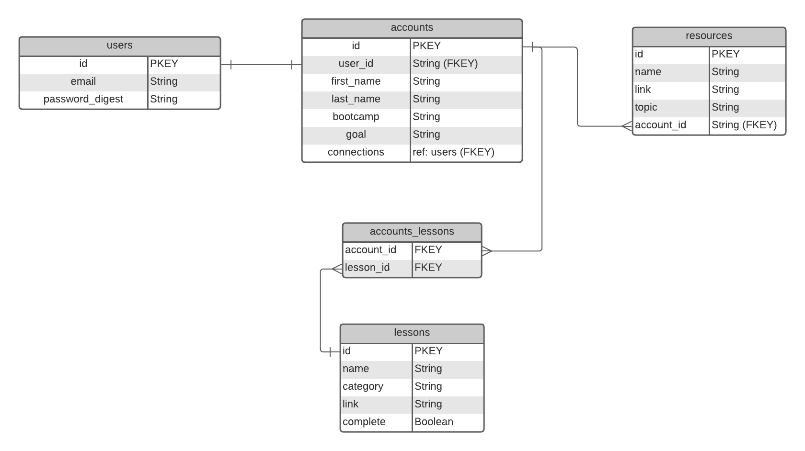

# PostBootCampPlanner
### 01/04/21
### Michael Zahuta

Links: [Github](https://github.com/MikeyZboy) | [Linkedin](https://www.linkedin.com/in/mikezahuta/)

***
### Description ###

The PostBootCampPlanner is for all of those who want to continue on a well organized learning path and meet like minded learners. PBCP is part expectation and goal setting, resources for skilling up, community building and networking, and a positivity posting board.

***
### Getting Started ###

Via web browser:

Simply navigate to the PostBootCampPlanner website and sign up or log in:

 - Create and bookmark links for your past tutorials, topics of interest, and challenges!
  
 - Discover new resources and create a library of your most helpful bookmarks!
  
 - Meet other learners from inside or outside your program network to collaborate on the post grad journey!
  
 - Post your achievements - keep building yourself up!

***
### User Stories ###

As a user, I should be able to land on the home page and understand what the PostBootCampPlanner is intended for.

As a user, I should be able to sign up, sign in, and fill out a user profile that details the skills I have, want to learn, and overall current goal.

As a user, I should be able to access a daily overview on the 'Home' page. My goal should be listed at the top, with a daily schedule on the left side, along with a calendar of weekly/monthly topics and deliverables. At the bottom should state the time and date, as well as an inspirational quote generated daily.

As a user, I should be able to use "Lessons" to fill out a small form to highlight Topics I've learned and relevant links to lessons, marked complete or not, and ranked. Perhaps, I'll even be able to write some initial notes/thoughts about the learnings for additional information on hover or when sharing to the community. 

As a user, I should be able to search "Resources" for quick, verified help about the topics we're covering. Some suggested resources will be provided (i.e. MDN, GeeksForGeeks, etc.), but I can add custom bookmarks to my own resources page. I can also access resources for children to help inspire and convey what I am learning.

As a user, I should be able to use the "Community" page to message other peers as well as use more networking/community driven content like blogs, Medium, Linkedin, Logrocket blog, etc.

As a user, I should be able to use the "Achievements" page to upload certifications, test scores, project snapshots, etc, to my own page to continually build my positive growth mindset. I can also access links to more learning platforms like Codecademy, freeCodeCamp, and Hackerrank.

***
### Planned Updates ###

- [ ] Coding Challenge Recommendations
- [ ] Linkedin Post direct from Achievements Board
- [ ] Current Job Postings Board

[Follow the Trello board for Future Updates](https://trello.com/b/9lgCRRFy/postbootcampplanner)

***
### ERD/Mapping ###

.png)

***
### Technologies Used ###

- HTML
- CSS
- AWS S3
- React
- Express
- Node
- Sequelize
- Postgres
  
***
### License ####

PostBootCampPlanner is under the MIT license.

***
#### Credits ####
AWS
projekt202
